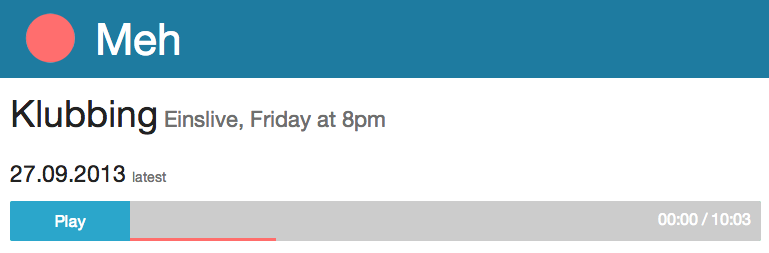

# *meh* — Audiostreams as podcasts [](https://travis-ci.org/pascalj/meh)  
*meh* is a Ruby web application that records parts from online audiostreams and provides them as podcasts. Perfect if your favorite radio show is not available as a podcast.



## Installation

### Prerequisites

**[Redis](http://redis.io/)** and **[Streamripper](http://streamripper.sourceforge.net/)** both must be installed in order for *meh* to work. Most Linux distributions have packages ready for you. Both are in the FreeBSD ports.

### Instructions

Clone *meh* into the target directory:

```
git clone git@github.com:pascalj/meh.git
```

Use bundler to install all dependencies:

```
cd meh && bundle install --without development
```

Start sidekiq:

```
sidekiq -d
```

Start the webserver:

```
RAILS_ENV=production bundle exec rails s
```

Meh should now be running. Now add a stream and a podcast and run:

```
rake meh:schedule
```

It will schedule the actual recordings. If you're running *meh* on a webserver you should install a cronjob to execute this rake task regularly. Once a week should be sufficient, but you can execute it more often, if you're more comfortable with that.

**Note:** It's important to set the timezone correctly or *meh* will assume UTC for the podcats' starting times.
Example for Berlin in `config/application.rb`:

`config.time_zone = 'Berlin'`

## Contributing

If you find a bug or want to add something please send me a pull request. I'll be glad to merge it. Just make sure the tests are passing by running `rake spec`. If you add code, please consider adding tests for it. Bug reports are also highly appreciated.
*meh* uses [Vagrant](http://www.vagrantup.com/) to make the development easier. To import the VM and set everything up, just install Vagrant and run `vagrant up`. You can ssh into the VM via `vagrant ssh`. The source is mounted at `/vagrant`.

##Copyright
###The MIT Licence
Copyright (c) 2013 Pascal Jungblut

Permission is hereby granted, free of charge, to any person obtaining a copy of this software and associated documentation files (the "Software"), to deal in the Software without restriction, including without limitation the rights to use, copy, modify, merge, publish, distribute, sublicense, and/or sell copies of the Software, and to permit persons to whom the Software is furnished to do so, subject to the following conditions:

The above copyright notice and this permission notice shall be included in all copies or substantial portions of the Software.

THE SOFTWARE IS PROVIDED "AS IS", WITHOUT WARRANTY OF ANY KIND, EXPRESS OR IMPLIED, INCLUDING BUT NOT LIMITED TO THE WARRANTIES OF MERCHANTABILITY, FITNESS FOR A PARTICULAR PURPOSE AND NONINFRINGEMENT. IN NO EVENT SHALL THE AUTHORS OR COPYRIGHT HOLDERS BE LIABLE FOR ANY CLAIM, DAMAGES OR OTHER LIABILITY, WHETHER IN AN ACTION OF CONTRACT, TORT OR OTHERWISE, ARISING FROM, OUT OF OR IN CONNECTION WITH THE SOFTWARE OR THE USE OR OTHER DEALINGS IN THE SOFTWARE.